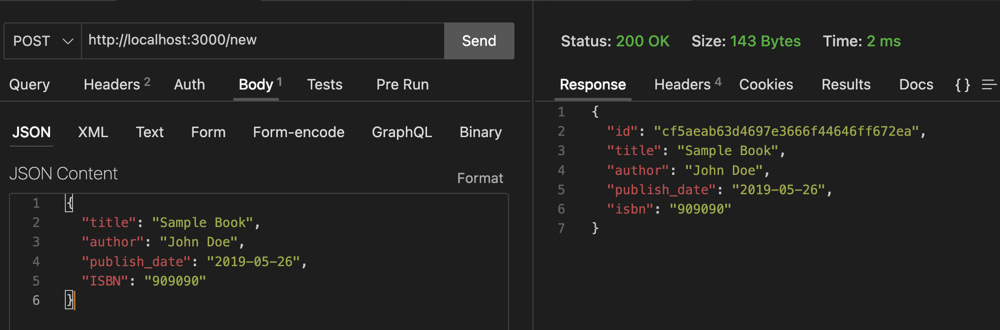

# GoLang Blockchain for Book Details

This project is a blockchain implementation in Go that stores book details. It provides three routes for interacting with the blockchain:

1. `http://localhost:3000/new` (POST) - Create a new Book.
2. `http://localhost:3000/` (POST) - Write data to the blockchain.
3. `http://localhost:3000/` (GET) - Retrieve the blockchain.

## How to Run

To run the project, follow these steps:

1. Clone the repository to your local machine:
   ```
   git clone https://github.com/IbrahimGhasia/GoLang-Blockchain.git
   ```

2. Then go to the directory
   ```
   cd GoLang-Blockchain
   ```

3. Run the main.go file 
   ```
   go run main.go
   ```

This will start the GoLang-Blockchain project on your local server. You can then use the specified routes to interact with the blockchain as described in the "Usage" section below.
## Usage

### Create a New Book
To create a new book, send a POST request to `/new` with a JSON body containing book details. The book will be added to the blockchain.

Example JSON for creating a new book:
```json
{
  "title": "Book Title",
  "author": "Author Name",
  "publish_date": "Publication Date",
  "isbn": "ISBN Number"
}
```



### Write Data to the Blockchain
To write data to the blockchain, send a POST request to / with a JSON body containing BookCheckout details. This data represents a book checkout event and will be added to the blockchain.

Example JSON for writing data to the blockchain:
```json
{
  "book_id": "unique_id",
  "user": "User Name",
  "checkout_date": "Checkout Date",
}
```


### Retrieve the Blockchain
To retrieve the blockchain, send a GET request to /. You will receive the entire blockchain, including all blocks and book details.


